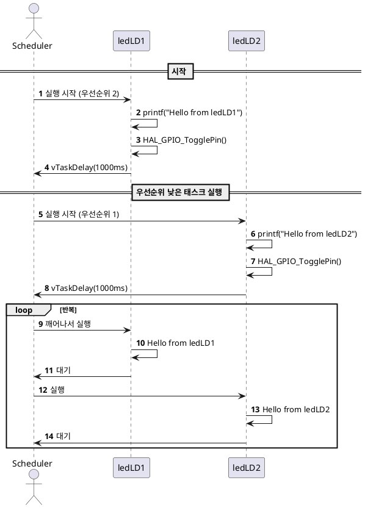

# FreeRTOS 심플 태스크

이 예제는 FreeRTOS 환경에서 두 개의 태스크를 생성하여 각각의 LED를 주기적으로 토글하면서, 태스크 우선순위에 따라 어떤 태스크가 먼저 실행되는지 확인할 수 있는 기본적인 구조를 제공합니다.

---

## 1. 목적 (Objective)

- FreeRTOS의 **`xTaskCreate()`**, **`vTaskDelay()`** 함수 사용법을 실습한다.
- **여러 개의 태스크가 동시에 주기적 작업**을 수행할 때 스케줄링 흐름을 이해한다.
- 우선순위에 따라 어떤 태스크가 먼저 실행되는지를 관찰한다.

---

## 2. 시스템 구성

| 항목         | 설명                          |
|--------------|-------------------------------|
| **ledLD1**   | LD1 핀 토글 (우선순위 2)       |
| **ledLD2**   | LD2 핀 토글 (우선순위 1)       |
| **Delay**    | 각각 1초마다 반복 수행        |
| **UART 로그**| printf를 통해 실행 확인 메시지 출력 |

---

## 3. 동작 시나리오

1. `main()` 함수에서 `ledLD1`과 `ledLD2` 태스크를 각각 생성함
2. `ledLD1`은 LD1 핀을 1초마다 토글하며 "Hello from ledLD1" 출력
3. `ledLD2`는 LD2 핀을 1초마다 토글하며 "Hello from ledLD2" 출력
4. 우선순위 2인 `ledLD1`이 기본적으로 먼저 스케줄되며,
   `ledLD2`는 CPU가 여유 있을 때 실행됨

---

## 4. 주요 함수

| 함수 | 설명 |
|------|------|
| `xTaskCreate()` | 태스크 생성 |
| `vTaskDelay()` | 일정 시간 동안 태스크를 Block 상태로 전환 |
| `vTaskStartScheduler()` | FreeRTOS 스케줄러 시작 |
| `HAL_GPIO_TogglePin()` | 지정한 GPIO 핀의 상태를 토글 |
| `printf()` | UART 로그 출력용 (대체 가능) |

---

## 5. UART 출력 예시
```
Hello from ledLD1
Hello from ledLD2
Hello from ledLD1
Hello from ledLD2
```

## 6. 코드 요약
