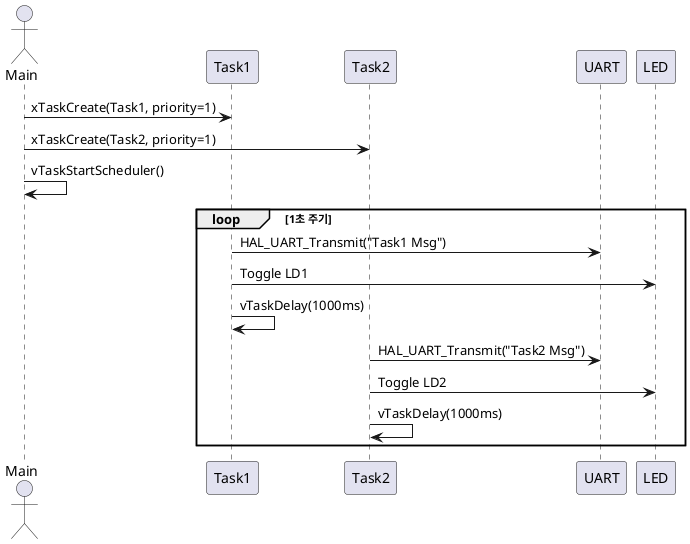

# 🧵 FreeRTOS Task Parameter 예제 튜토리얼

이 문서는 두 개의 FreeRTOS 태스크가 각각 다른 메시지를 UART로 출력하고, LED를 토글하는 예제를 통해 다음 개념들을 학습합니다:

- Task에 파라미터 전달
- 동일 우선순위 Task 간 **라운드 로빈(Round-Robin)** 동작
- **컨텍스트 스위칭**이 어떻게 일어나는지 이해

---

## 1. Objective (목표)

- FreeRTOS Task에 문자열 메시지를 **파라미터로 전달**하는 방법 학습
- 전달받은 메시지를 **UART로 주기적으로 출력**
- Task마다 LED를 토글하며 실행 중임을 표시
- 동일 우선순위 Task 간 **공정한 CPU 시간 분배** 구조를 체험(라운드로빈)
- 1초마다 각각의 TASK 수행되어야 하지만, 라운드 로빈발생

---

## 2. 🔧 주요 구성 요소

| 구성 요소     | 설명 |
|--------------|------|
| `Task1()`    | `"Task1 Msg"` 출력, LD1 토글 |
| `Task2()`    | `"Task2 Msg"` 출력, LD2 토글 |
| `xTaskCreate()` | Task 생성 시 파라미터(`const char*`) 전달 |
| 우선순위      | 두 Task 모두 `priority = 1` (라운드 로빈 발생) |

---

## 3.  주요 코드 요약

###  전역 문자열 정의

```c
const char* task1_msg = "Task1 Msg  !\r\n";
const char* task2_msg = "Task2 Msg  !\r\n";
 Task 함수 (공통 구조)
```c
void TaskX(void *pvParameters) {
    const char* msg = (const char*) pvParameters;
    while (1) {
        HAL_UART_Transmit(&huart3, (uint8_t *)msg, strlen(msg), HAL_MAX_DELAY);
        HAL_GPIO_TogglePin(GPIOB, LDx_Pin);
        vTaskDelay(pdMS_TO_TICKS(1000));
    }
}
 main 함수
```c
int main(void) {
    Driver_Init();
    xTaskCreate(Task1, "Task1", 256, (void*)task1_msg, 1, NULL);
    xTaskCreate(Task2, "Task2", 256, (void*)task2_msg, 1, NULL);
    vTaskStartScheduler();
    while (1) {}
}
```
## 4. 라운드 로빈 & 컨텍스트 스위칭
Task1과 Task2는 동일한 우선순위(1) 를 가지므로,

FreeRTOS는 Tick 마다 번갈아 Task를 실행합니다.

vTaskDelay()가 호출되면 해당 Task는 Block 상태가 되고,
다른 Ready 상태 Task가 즉시 실행됩니다.

 이 방식은 Round-Robin 스케줄링이며,
모든 동일 우선순위 Task에 공평하게 CPU를 분배합니다.

## 5. 시퀀스 다이어그램 (PlantUML)

👉 위 다이어그램은 https://plantuml-editor.kkeisuke.com/에서 붙여넣으면 확인 가능합니다.

## 6. 요약
항목	설명
pvParameters	Task에 사용자 지정 메시지 전달
xTaskCreate()	Task 등록 및 파라미터 설정
vTaskDelay()	Task를 일정 시간 동안 Block 상태로 전환
라운드 로빈 스케줄링	동일 우선순위 Task 간 CPU 분배
컨텍스트 스위칭	실행 중 Task → 다른 Task 전환

## 7. 활용 아이디어
여러 디바이스 상태를 주기적으로 출력하는 구조 설계
동일 코드 기반 Task 재사용 시, 파라미터만 변경하여 동작 분기
상태 모니터링, 디버깅, LED 점멸 제어 등 Task 간 역할 분담

## 8. 결론
이 예제는 FreeRTOS의 Task 기본 개념을 실습하며 다음을 이해할 수 있도록 돕습니다:
Task에 문자열 파라미터를 전달하고 사용하는 방법
동일 우선순위 Task 간 라운드 로빈 방식 스케줄링
vTaskDelay와 컨텍스트 스위칭의 실동작 구조
구조화된 Task 설계와 UART + GPIO 활용