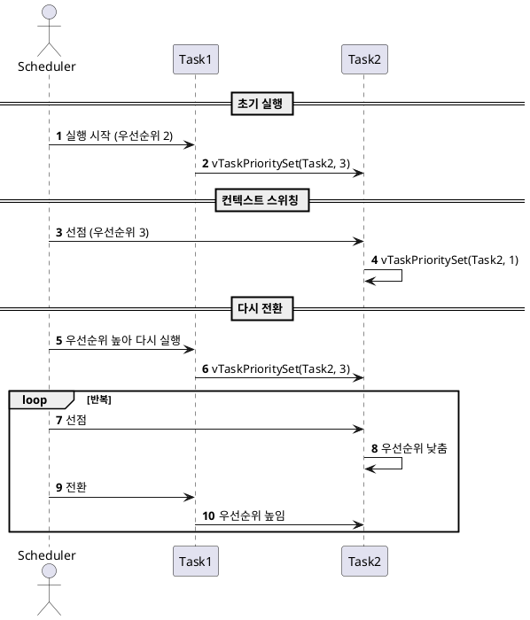

# 🧵 FreeRTOS 태스크 우선순위 변경 예제 (changepriority.c)

이 예제는 FreeRTOS 환경에서 두 개의 태스크 간 우선순위를 동적으로 변경하며 **컨텍스트 스위칭**이 어떻게 발생하는지를 보여줍니다.

---

## 1.목적 (Objective)

- 태스크의 우선순위를 **동적으로 변경**하는 방법을 이해한다.
- 우선순위 변경에 따라 발생하는 **선점(Context Switching)** 동작을 확인한다.
- `vTaskPrioritySet()`과 `uxTaskPriorityGet()`의 사용법을 실습한다.

---

## 2.시스템 구성

| 항목       | 설명 |
|------------|------|
| **Task1**  | Task2의 우선순위를 높임 |
| **Task2**  | 자신의 우선순위를 낮춤 |
| **UART 로그** | 한글로 우선순위 변경 내역 출력 |
| **우선순위** | 초기: Task1(2), Task2(1) |

---

## 3.동작 시나리오

1. **Task1**이 실행되고, Task2의 우선순위를 **Task1 + 1**로 올림
2. Task2가 선점되어 실행됨
3. **Task2**는 자신의 우선순위를 **-2** 하여 다시 Task1보다 낮춤
4. 다시 **Task1**이 실행됨 → 반복

---

## 4.주요 함수

| 함수 | 설명 |
|------|------|
| `uxTaskPriorityGet(NULL)` | 현재 태스크의 우선순위 반환 |
| `vTaskPrioritySet()` | 태스크 우선순위를 동적으로 설정 |
| `xTaskCreate()` | 태스크 생성 |
| `vTaskStartScheduler()` | FreeRTOS 스케줄러 시작 |

---

## 5.UART 출력 예시

```
Task2 생성 성공
Task1: Task2의 우선순위를 높입니다.
Task2: 자신의 우선순위를 다시 낮춥니다.
Task1: Task2의 우선순위를 높입니다.
Task2: 자신의 우선순위를 다시 낮춥니다.
```

## 6.코드 요약

```c
void Task1(void *pvParameters) {
    UBaseType_t uxPriority = uxTaskPriorityGet(NULL);
    for (;;) {
        HAL_UART_Transmit(&huart3, (uint8_t *)"Task1: Task2의 우선순위를 높입니다.\r\n", ...);
        vTaskPrioritySet(xTask2Handle, uxPriority + 1);
    }
}

void Task2(void *pvParameters) {
    UBaseType_t uxPriority = uxTaskPriorityGet(NULL);
    for (;;) {
        HAL_UART_Transmit(&huart3, (uint8_t *)"Task2: 자신의 우선순위를 다시 낮춥니다.\r\n", ...);
        vTaskPrioritySet(NULL, uxPriority - 2);
    }
}
```
## 7. 시퀀스 다이어그램


💡 위 다이어그램은 PlantUML 뷰어나 VS Code 플러그인 등을 통해 시각화할 수 있습니다.

## 8.결론
우선순위가 높은 태스크는 낮은 태스크를 즉시 선점한다.

우선순위를 동적으로 설정하면 실시간 제어 흐름을 유연하게 조절할 수 있다.

vTaskPrioritySet()은 타 태스크 또는 자신에게도 적용할 수 있다 (NULL 사용 시 자기 자신).