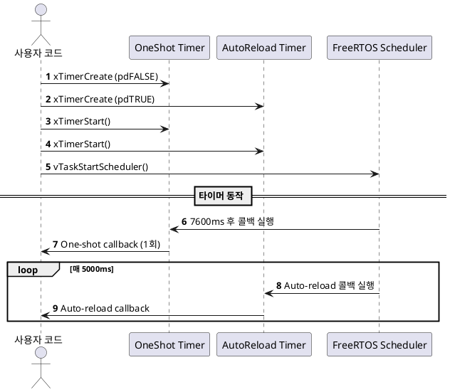

# FreeRTOS 소프트웨어 타이머 예제
FreeRTOS의  One-shot 타이머와 Auto-reload 타이머를 생성하고, 각각의 콜백에서 Tick 정보를 출력하는 방식으로 동작을 시각화합니다.

## 1. 목적 (Objective)
FreeRTOS 소프트웨어 타이머의 종류(One-shot, Auto-reload)를 테스트
타이머 생성, 시작, 콜백 실행 시점을 확인
타이머 콜백 함수 내에서 xTaskGetTickCount()를 통해 Tick 기반 타이밍을 확인한다.

## 2. 시스템 구성
항목	설명
One-shot Timer	한 번만 콜백이 호출되는 타이머
Auto-reload Timer	주기적으로 반복되는 콜백 호출 타이머
Tick Interval	One-shot: 7600ms, Auto: 5000ms
ulCallCount	두 콜백 모두에서 호출 횟수 증가

## 3. 동작 시나리오
시스템 초기화 후 두 개의 타이머 생성
One-shot 타이머는 1회만 콜백 호출
Auto-reload 타이머는 5초마다 반복적으로 콜백 호출

각 콜백은 현재 Tick 수를 출력하고 호출 횟수를 증가시킴

## 4. 주요 함수
함수	설명
- **xTimerCreate()**	타이머 핸들 생성 (이름, 주기, 반복 여부, ID, 콜백)
- **xTimerStart()**	생성된 타이머를 시작함
- **vTaskStartScheduler()**	FreeRTOS 스케줄러 시작
- **xTaskGetTickCount()**	현재 Tick 수 반환
- **prvOneShotTimerCallback()**	One-shot 타이머 콜백 함수
- **prvAutoReloadTimerCallback()**	Auto-reload 타이머 콜백 함수

## 5. UART 출력 예시
```yaml
One-shot timer callback executed at tick: 7610
Auto-reload timer callback executed at tick: 12610
Auto-reload timer callback executed at tick: 17610
```
## 6. 코드 요약
```c
xTimerCreate("OneShot", 7600ms, pdFALSE, ..., prvOneShotTimerCallback);
xTimerCreate("AutoReload", 5000ms, pdTRUE, ..., prvAutoReloadTimerCallback);
xTimerStart(xOneShotTimer, 0);
xTimerStart(xAutoReloadTimer, 0);
```
## 7. 시퀀스 다이어그램

💡 위 다이어그램은 PlantUML 뷰어나 VS Code 플러그인으로 시각화할 수 있습니다.

## 8. 결론
One-shot 타이머는 단발성으로 동작하며, 재시작 전까지 반복되지 않는다.
Auto-reload 타이머는 주기적으로 콜백을 실행하여, 주기적인 작업에 유용하다.
타이머 콜백 안에서 xTaskGetTickCount()를 통해 시간 흐름을 추적할 수 있다.
필요 시 ulCallCount 값을 이용하여 타이머 호출 횟수를 누적 확인할 수 있습니다.