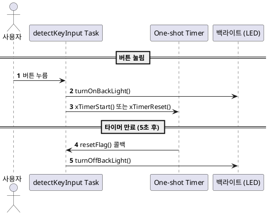

# FreeRTOS + One-shot Timer: 버튼 입력 후 백라이트 자동 OFF 제어 예제
이 예제는 사용자 버튼을 눌렀을 때 LED 백라이트를 켜고, 5초 뒤 자동으로 끄는 One-shot 소프트웨어 타이머 제어 방식을 보여줍니다.

## 1. 목적 (Objective)
버튼 입력을 감지하여 백라이트 ON
5초 타이머를 통해 자동으로 백라이트 OFF
타이머가 이미 작동 중일 경우, 리셋을 통해 다시 5초 대기

## 2. 시스템 구성
항목	설명
입력	USER_Btn (GPIO 버튼)
출력	LD1, LD2, LD3 (GPIO LED 백라이트)
타이머	xTimerCreate() 사용, 5초 One-shot
폴링 주기	50ms (디바운싱 겸용)

## 3. 동작 시나리오
프로그램 시작 시 타이머는 대기 상태
버튼을 누르면 백라이트 ON
이후 5초 후 resetFlag() 콜백에서 백라이트 OFF
버튼이 눌릴 때마다 타이머가 리셋되어 5초가 연장됨

## 4. 주요 함수
함수	설명
- **HAL_GPIO_ReadPin()**	버튼 입력 읽기
- **HAL_GPIO_WritePin()**	LED 백라이트 제어
- **xTimerCreate()**	소프트웨어 타이머 생성
- **xTimerStart()**	타이머 시작
- **xTimerReset()**	타이머 재시작
- **xTimerIsTimerActive()**	타이머 실행 중 여부 확인
- **vTaskDelay()**	폴링 간격 제어 (50ms)

## 5. UART 출력 예시 (버튼 눌렀을 시)
```perl
reset Flag
```
## 6. 코드 요약
```c
if (button 눌림 감지됨) {
    turnOnBackLight();
    isButtonPushed = true;

    if (xTimerIsTimerActive(oneShotTimerHandle) == pdFALSE)
        xTimerStart(oneShotTimerHandle, 0);
    else
        xTimerReset(oneShotTimerHandle, 0);
}
```
## 7. 시퀀스 다이어그램 (PlantUML)

## 8. 결론
사용자의 단일 입력 이벤트를 트리거로, 타이머를 이용해 일정 시간 후 자동 동작을 구현할 수 있음

타이머 상태 확인 및 리셋 기능을 통해 사용자 경험 향상 (입력 반복 시 대기 시간 연장)