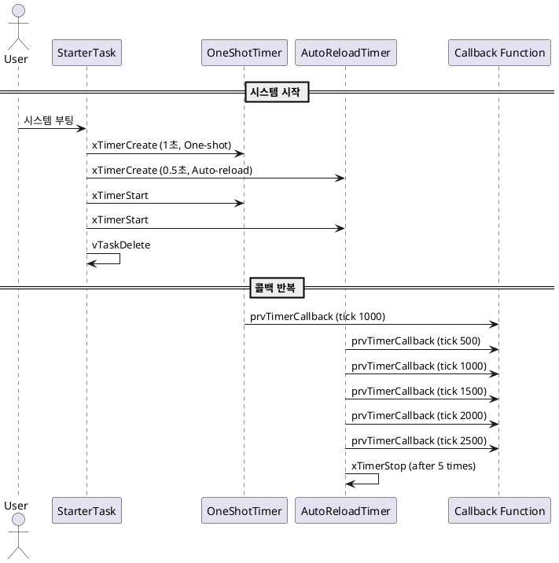

# 🕒 FreeRTOS 타이머 예제: One-Shot & Auto-Reload

##  목적 (Objective)

이 예제는 FreeRTOS에서 **One-Shot 타이머**와 **Auto-Reload 타이머**를 함께 사용하는 구조를 보여줍니다.  
타이머 콜백에서 각 타이머의 ID 및 핸들을 활용하여 **타이머 종류를 구분**하고,  
**동적으로 타이머 동작을 제어**하는 기법을 실습합니다.

---

##  시스템 구성

| 구성 요소        | 설명                                       |
|------------------|--------------------------------------------|
| `xOneShotTimer`  | 1회만 실행되는 타이머 (1초 후 실행)        |
| `xAutoReloadTimer` | 반복 실행되는 타이머 (0.5초 간격, 최대 5회) |
| `vStarterTask`   | 타이머 생성 및 시작 담당 태스크            |
| `prvTimerCallback` | 타이머 콜백 함수, 실행 횟수를 추적함     |

---

##  동작 시나리오

1. 시스템이 시작되면 `vStarterTask`가 실행되어 두 개의 타이머를 생성하고 시작합니다.
2. One-Shot 타이머는 **1초 후 한 번만 콜백**을 호출합니다.
3. Auto-Reload 타이머는 **0.5초마다 콜백**을 호출하며, **5회 후 정지**됩니다.
4. 각 콜백에서는 실행 시각과 어떤 타이머인지 로그를 출력합니다.

---

##  주요 함수 요약

| 함수명                  | 설명 |
|-------------------------|------|
| `xTimerCreate()`        | 타이머 생성 |
| `xTimerStart()`         | 타이머 시작 |
| `xTimerStop()`          | 타이머 정지 |
| `vTimerSetTimerID()`    | 사용자 정의 데이터(ID) 설정 |
| `pvTimerGetTimerID()`   | ID 값 읽기 |
| `xTaskGetTickCount()`   | 현재 Tick 읽기 |
| `vPrintStringAndNumber()` | 로그 출력 (tick 포함) |

---

##  UART 출력 예시 (출력 결과)
```log
One-shot timer callback executing at tick 1000
Auto-reload timer callback executing at tick 500
Auto-reload timer callback executing at tick 1000
Auto-reload timer callback executing at tick 1500
Auto-reload timer callback executing at tick 2000
Auto-reload timer callback executing at tick 2500
```

##  동작 개요 (PlantUML 시퀀스 다이어그램)


💡 위 다이어그램은 One-Shot과 Auto-Reload 타이머가 어떻게 작동하며 콜백이 어떻게 호출되는지 시각적으로 설명합니다.

✅ 참고사항
xTimer == xOneShotTimer 비교는 실제 타이머 핸들 주소를 비교하여 어떤 타이머에서 호출되었는지 판별하는 용도입니다.
pvTimerID를 사용해 실행 횟수를 추적할 수 있고, 필요시 구조체로도 확장 가능합니다. (디버깅 용이-로그에 이름 출력 가능)


