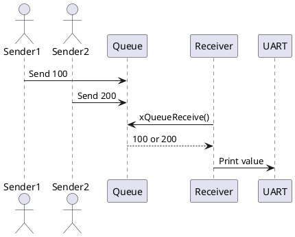

# FreeRTOS Queue 통신 예제: Blocking Queue

## 1.목적 (Objective)

두 개의 송신 Task가 각각 고유 데이터를 주기적으로 전송하고,  
수신 Task가 큐로부터 데이터를 수신하여 처리하는 **동기화된 Queue 통신** 구조를 학습한다.

## 2.시스템 구성

| Task 이름    | 우선순위 | 기능 설명                                     |
|-------------|----------|----------------------------------------------|
| Sender1     | 1        | 값 `100`을 200ms마다 큐로 전송               |
| Sender2     | 2        | 값 `200`을 200ms마다 큐로 전송               |
| Receiver    | 3        | 큐로부터 데이터를 대기(block)하며 즉시 처리   |

- 큐 크기: `5`
- 큐 타입: `int32_t`
- 대기 조건:  
  - 송신자는 큐가 가득 차면 `0 tick` 대기 후 실패 처리  
  - 수신자는 데이터가 들어올 때까지 `portMAX_DELAY`로 무한 대기

## 3.동작 시나리오

```plaintext
[Sender1]  -->\
               \
                --> [xQueue] --> [Receiver] --> UART 출력
               /
[Sender2]  -->/
```
Sender1, Sender2는 데이터를 주기적으로 큐에 xQueueSendToBack() 함수를 사용하여 전송
Receiver는 xQueueReceive()로 블로킹 대기 상태이며, 수신 즉시 UART 출력
uxQueueMessagesWaiting()을 통해 데이터 수신 직전 큐의 비정상 상태 감지 (디버깅용)
 
### 주요 함수 설명
함수	설명
- **xQueueCreate(5, sizeof(int))**	크기 5, int형 큐 생성
- **xQueueSendToBack()**	송신 Task가 데이터를 큐 뒤로 전송
- **xQueueReceive()**	수신 Task가 큐에서 데이터 수신
- **uxQueueMessagesWaiting()**	큐 내 메시지 수 확인

### 주요 Task 동작 코드 요약
Sender Task
```c
int32_t valueToSend = (int32_t )pvParams;
xQueueSendToBack(xQueue, &valueToSend, 0);
vTaskDelay(pdMS_TO_TICKS(200));
```
Receiver Task
```c
if (uxQueueMessagesWaiting(xQueue) != 0) {
    printf("Queue should have been empty!\r\n");
}

xQueueReceive(xQueue, &lReceivedValue, portMAX_DELAY);
printf("Received value: %ld\r\n", (long)lReceivedValue);
```
## 4.UART 출력 예시
```plaintext
Received value: 100
Received value: 200
Received value: 100
```

### 5.시퀀스 다이어그램

## 6.기대 결과
수신자는 모든 값을 큐에 데이터가 많아지지 않도록 수신자가 빠르게 처리(우선 순위 높음, xQueueReceive 함수를 통해 수신 TASK 블락상태로 변경됨.)
큐가 가득 차면 송신자는 전송 실패 로그 출력
Note: 수신자의 우선순위가 가장 높기 때문에, 거의 항상 큐는 비워진 상태가 유지됩니다.