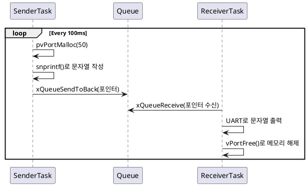

## 1.Objective
이 예제의 목적은 FreeRTOS에서 큐를 통해 포인터를 안전하게 전달하는 방법을 실습하는 것입니다.
포인터 자체를 전달함으로써 문자열 또는 구조체 같은 큰 데이터를 복사하지 않고, 효율적으로 태스크 간 통신을 수행합니다.

## 2.동작 시나리오
🧾 PlantUML 시퀀스 다이어그램


## 3.주요 함수 설명
🔹 SenderTask
```c
pcToSendStirng  = (char *)pvPortMalloc(50);
snprintf(pcToSendStirng, 50, "Hello from SenderTask %d\r\n", sendIndex++);
xQueueSendToBack(xQueue, &pcToSendStirng, portMAX_DELAY);
pvPortMalloc()으로 동적 메모리 확보 (50 bytes)
snprintf()로 문자열 생성
```
포인터만 큐에 전송 → 문자열 전체를 복사하지 않아 오버헤드 감소

🔹 ReceiverTask
```c
void ReceiverTask(void *pvParameters) {
    char * pcReceivingString;
    while (1) {
        if (xQueueReceive(xQueue, &pcReceivingString, portMAX_DELAY) == pdPASS) {   
            vPortFree(pcReceivingString); // Free the buffer after use
        } 
    }
}
```
큐에서 포인터 수신
문자열 사용 후 반드시 vPortFree()로 해제
→ 해제하지 않으면 Memory Leak 발생

## 4.Expected Output
시리얼 터미널에서 다음과 같은 출력이 반복됨:

```log
Hello from SenderTask 0
Hello from SenderTask 1
Hello from SenderTask 2
```

## 5.큐잉포인터 vs 기존 방식
큐잉포인터  성능 오버헤드	높음	낮음 ( )
메모리 관리	자동	수신 측에서 해제 필요

> 🔹비유
> 기존 방식: 편지를 복사해서 우체국(큐)에 넣는 것
> 복사본이 많으면 무겁고 느려요
> 포인터 방식: 편지를 가리키는 주소 메모만 보내는 것
> → 우체국에서는 주소만 받고, 수신자가 해당 주소로 직접 찾아가서 열어보고, 읽고 나서 폐기

➕ 추가 확장
포인터의 주소 자체를 또 큐에 보낼 수 있음 → "주소의 주소"
이는 이중 포인터 char **로 표현됨 (ex. 이중 구조체 관리 등)

⚠️ 주의사항
메모리 소유권(Ownership): 할당과 해제의 책임 분명히 할당
Sender가 malloc, Receiver가 free
메모리 누수(Memory Leak): vPortFree() 생략 시 발생
댕글링 포인터(Dangling Pointer): 해제 후 접근 금지

✅ 결론
FreeRTOS에서 포인터 기반 큐 전송이 성능을 어떻게 향상시키는지를 알 수 있습니다.
단, 정확한 메모리 관리가 필수이며, 포인터 전달은 항상 책임 있는 해제가 뒤따라야 함.