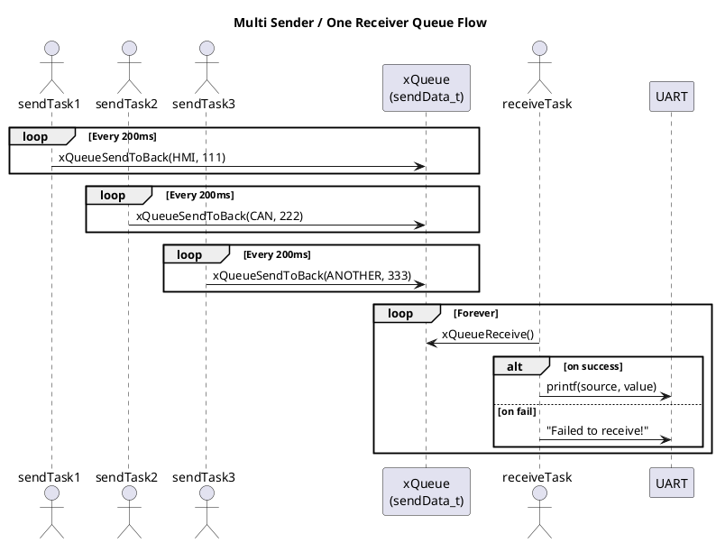

# Multiple Source Queue

송신 Task들은 각각 고유한 `데이터 식별자(ID)`와 `값(Value)`를 포함한 구조체 데이터를 생성하여 공용 Queue로 전송하며, 수신 Task는 이 Queue에서 데이터를 수신한 후, 식별자(ID)에 따라 통신 메시지를 분류하고 처리하는 방식이 필요

---

## 1. Objective

- `sendData_t` 구조체를 통해 Source와 값(Value)을 함께 큐에 전송
- 각 송신 Task는 고유 Source를 기반으로 주기적으로 데이터를 전송
- 수신 Task는 Queue에서 데이터를 수신하고 Source에 따라 처리 수행
- `uxQueueMessagesWaiting()`를 통해 큐 상태를 모니터링

---

## 2. 시스템 구성

| 구성 요소       | 설명 |
|----------------|------|
| `sendTask1`    | Source: `SOURCE_HMI`, 전송값: 111 |
| `sendTask2`    | Source: `SOURCE_CAN`, 전송값: 222 |
| `sendTask3`    | Source: `SOURCE_ANOTHER`, 전송값: 333 |
| `receiveTask`  | 각 Task로부터 데이터를 수신하고 처리 |
| `xQueue`       | `sendData_t` 구조체 큐, 길이 4 |

---

## 3. 주요 구조체

```c
typedef enum {
    SOURCE_HMI,
    SOURCE_CAN,
    SOURCE_ANOTHER
} DataSource_t;

typedef struct {
    DataSource_t source;
    uint32_t uxValue;
} sendData_t;
```

## 4.시퀀스 다이어그램


## 5.UART 출력 예시
```bash
Received from source 0: value = 111
Received from source 1: value = 222
Received from source 2: value = 333
```
※ source 값은 enum 기반 정수 (0 = HMI, 1 = CAN, 2 = ANOTHER)로 출력됨

⚠️ 주의 사항
sendDataPointer는 구조체 복사본을 생성하므로 원본은 변경되지 않음
uxQueueMessagesWaiting(xQueue) != 3 조건문은 큐가 가득 찼는지 확인
송신 Task가 빠르게 실행되어도 큐가 4개까지 버퍼링 가능
Source에 따른 분기 처리는 switch(receivedData.source)로 확장 가능

✅ 결론
이 구조는 여러 소스에서 공통 큐로 데이터를 보낼 때 매우 유용
Source를 기준으로 분기 처리 및 로깅, 통계 등 다양하게 확장 가능
구조체 기반으로 통일된 인터페이스를 제공하여 유지 보수 용이성 향상