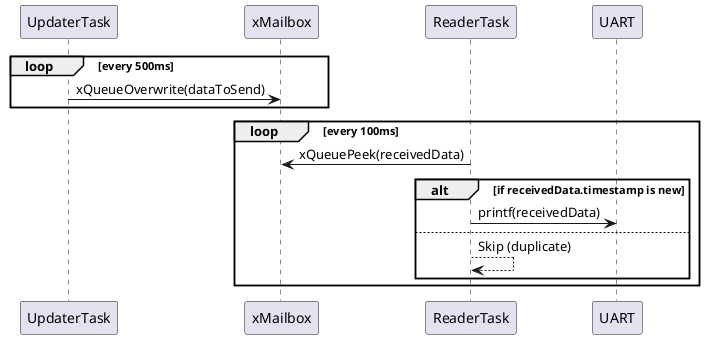

# FreeRTOS Mailbox Queue Example

## 1.목적 (Objective)

 FreeRTOS의 `xQueueOverwrite()`와 `xQueuePeek()` API를 사용하여  
`가장 최신 데이터만 가져오는 큐(메일박스)를 테스트
- 송신 Task는 주기적으로 값과 타임스탬프를 큐에 `덮어쓰기(xQueueOverwrite)` 방식으로 전송합니다.
- 수신 Task는 `xQueuePeek()`을 통해 큐의 내용을 읽고, 마지막으로 받은 timestamp와 비교하여 `중복 출력 방지` 처리를 합니다.

---

## 2.시스템 구성

| Task 이름     | 역할                                   | 주요 API 사용            |
|--------------|----------------------------------------|--------------------------|
| `vUpdaterTask` | 주기적으로 값 증가 후 Mailbox에 덮어쓰기 | `xQueueOverwrite()`      |
| `vReaderTask`  | Mailbox에서 최신 값만 확인하고 출력    | `xQueuePeek()` + 타임스탬프 비교 |

---

## 3.동작 시나리오

1. 시스템 초기화 후 길이 1의 큐(`xMailbox`)가 생성됨
2. `vUpdaterTask`가 값과 Tick을 주기적으로 `xQueueOverwrite()`로 큐에 기록
3. `vReaderTask`는 `xQueuePeek()`으로 데이터를 읽음
4. 이전에 수신한 timestamp와 비교하여 중복 데이터는 무시, 새로운 데이터만 출력

---

## 4.핵심 포인트

- 일반적인 큐는 가득 차면 전송 실패 (`xQueueSend()` → FAIL)
- `xQueueOverwrite()`는 큐 길이에 상관없이 **기존 데이터를 덮어쓰기** 때문에  
  **항상 최신 데이터만 유지**하는 데 적합
- `xQueuePeek()`은 데이터를 **제거하지 않고 읽기만** 하므로  
  수신자가 데이터의 변화를 감지하고 처리 가능

---

## 5.출력 예시 (UART 로그)
```
Received value: 3 (Tick: 12345)
Received value: 4 (Tick: 12845)
Received value: 5 (Tick: 13345)
```


## 6.PlantUML 시퀀스 다이어그램


🧪 응용 가능성
센서 데이터 수집 시 최근값만 유지
UI에 최신 상태만 반영 (ex. 온도, 속도, 위치 등)
CAN, UART 등에서 단일 ID에 해당하는 최신 메시지 처리용
⚠️ 주의
과거 기록이 필요한 경우 사용하지 말것(Fault Log)