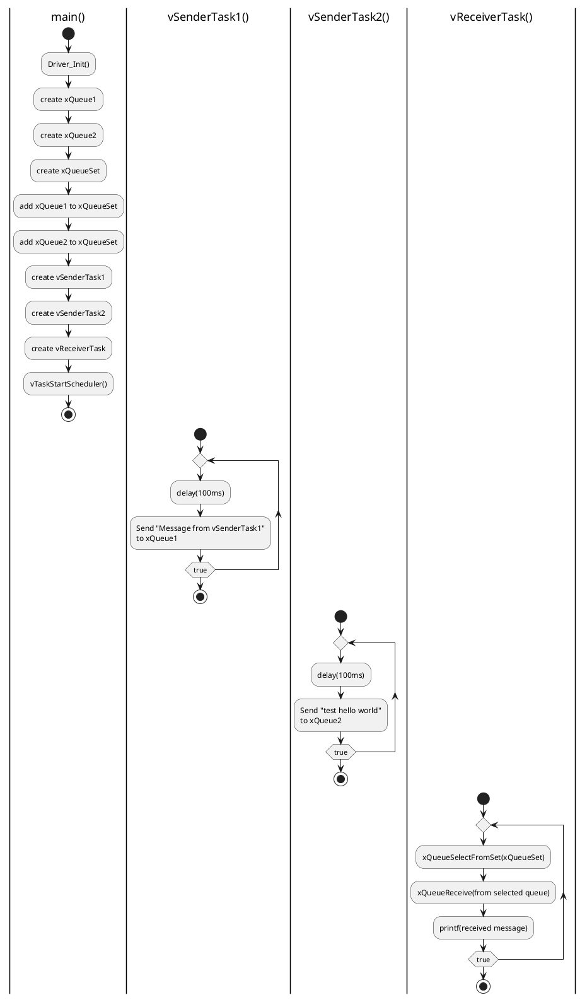

# `queueset.c` 튜토리얼

이 문서는 `queueset.c` 예제 코드의 목적, 동작 방식 및 예상 결과에 대해 설명합니다.

## 1. Objective (목표)

이 예제의 주요 목표는 FreeRTOS의 `큐 세트(Queue Set)`를 사용하여 여러 큐로부터 들어오는 데이터를 단일 태스크에서 효율적으로 처리하는 방법을 시연하는 것입니다. 큐 세트를 사용하면, 수신 태스크는 어떤 큐에 데이터가 도착했는지 일일이 확인할 필요 없이, 여러 큐 중 하나라도 데이터가 수신되기를 기다릴 수 있습니다.

이 예제에서는 두 개의 송신 태스크가 각각 다른 큐에 메시지를 보내고, 하나의 수신 태스크가 큐 세트를 통해 두 큐 중 어느 곳에서든 데이터가 오기를 기다렸다가 처리하는 과정을 보여줍니다.




## 2. Code Description (코드 설명)

- **`vSenderTask1(void *pvParameters)`**
  - 100ms마다 `xQueue1`에 `"Message from vSenderTask1\r\n"`이라는 문자열의 포인터를 보냅니다.

- **`vSenderTask2(void *pvParameters)`**
  - 100ms마다 `xQueue2`에 `"test hello world\r\n"`이라는 문자열의 포인터를 보냅니다.

- **`vReceiverTask(void *pvParameters)`**
  - `xQueueSelectFromSet()` 함수를 사용하여 큐 세트(`xQueueSet`)에 포함된 큐 중 하나라도 데이터가 수신될 때까지 무한정 대기(`portMAX_DELAY`)합니다.
  - 데이터가 수신되면, `xQueueSelectFromSet()`은 데이터가 포함된 큐의 핸들(`xQueueThatContainsData`)을 반환합니다.
  - 반환된 큐 핸들을 사용하여 `xQueueReceive()`를 호출하고, 해당 큐로부터 메시지 포인터를 읽어옵니다.
  - 수신된 문자열을 시리얼 포트로 출력합니다.

- **`main(void)`**
  - `Driver_Init()`를 호출하여 MCU의 하드웨어를 초기화합니다.
  - `xQueueCreate()`를 사용하여 `xQueue1`과 `xQueue2`를 각각 크기 1로 생성합니다. 각 큐는 문자열 포인터(`char *`)를 저장합니다.
  - `xQueueCreateSet()`를 사용하여 두 개의 큐를 담을 수 있는 큐 세트(`xQueueSet`)를 생성합니다.
  - `xQueueAddToSet()`를 호출하여 `xQueue1`과 `xQueue2`를 `xQueueSet`에 추가합니다.
  - `xTaskCreate` 함수를 사용하여 `Sender1`, `Sender2`, `Receiver` 태스크를 생성합니다.
    - `Sender1`, `Sender2` 우선순위: 1
    - `Receiver` 우선순위: 2 (더 높음)
  - `vTaskStartScheduler()`를 호출하여 FreeRTOS 스케줄러를 시작합니다.

## 3. Expected Output (예상 결과)

코드가 실행되면, `Sender1`과 `Sender2` 태스크는 각각 100ms마다 자신의 큐에 메시지를 보냅니다. `Receiver` 태스크는 우선순위가 더 높지만, 큐 세트에 데이터가 도착할 때까지 대기 상태에 있습니다. `Sender` 태스크 중 하나가 큐에 데이터를 보내면, `Receiver` 태스크가 즉시 활성화되어 해당 데이터를 처리하고 출력합니다.

### 3.1. 시리얼 출력 (Serial Output)

시리얼 터미널에는 두 `Sender` 태스크가 보내는 메시지가 번갈아 가며 출력됩니다. 두 태스크의 지연 시간이 같으므로, 스케줄링에 따라 거의 교대로 출력됩니다.

```
Message from vSenderTask1

test hello world

Message from vSenderTask1

test hello world

```

## 4. Queue Set 동작 방식

1. **초기 상태**: `Receiver` 태스크는 우선순위가 가장 높지만, `xQueueSelectFromSet()`에서 큐 세트가 비어있어 대기(Blocked) 상태가 됩니다.
2. **데이터 전송**: `Sender1`과 `Sender2`는 우선순위가 같으므로 번갈아 실행됩니다. 예를 들어 `Sender1`이 먼저 실행되어 `xQueue1`에 메시지를 보냅니다.
3. **큐 세트 활성화**: `xQueue1`에 데이터가 들어오면, 이 큐가 속한 `xQueueSet`이 활성화됩니다. 이로 인해 대기 중이던 `Receiver` 태스크가 준비(Ready) 상태가 됩니다.
4. **데이터 수신**: `Receiver`는 우선순위가 가장 높으므로 즉시 실행됩니다. `xQueueSelectFromSet()`은 데이터가 있는 `xQueue1`의 핸들을 반환하고, `Receiver`는 이 핸들을 사용해 데이터를 읽고 출력합니다.
5. **반복**: `Receiver`가 다시 `xQueueSelectFromSet()`에서 대기 상태로 돌아가면, 다른 `Sender` 태스크(`Sender2`)가 `xQueue2`에 데이터를 보냅니다. 이 과정이 계속 반복됩니다.

큐 세트는 여러 이벤트 소스(이 경우, 여러 큐)를 동시에 기다려야 할 때 매우 유용한 동기화 메커니즘입니다. 이를 통해 복잡한 `if-else`나 폴링(polling) 로직 없이도 코드를 깔끔하고 효율적으로 작성할 수 있습니다.

```