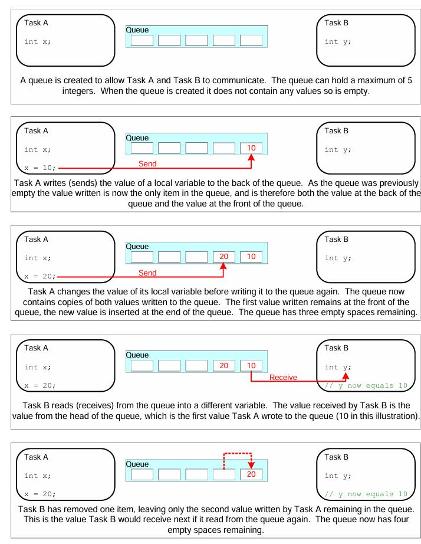

# 📦 FreeRTOS Queue 

###  큐는 먼저온 데이터 순서대로(First-In-First-Out) 처리함

### 💬 그림 설명

- **TaskA**는 데이터를 전송 (✉️ Writer)
- **TaskB**는 데이터 리드 (📬 Reader)
- **Queue**는 공용 데이터 버퍼
---

## ⚠️ Read와 Write가 동시에 일어나면?
- 32비트 시스템에서 여러 Task나 인터럽트가 동시에 동일한 변수에 Read와 Write를 하면,
- 데이터가 중간에 섞이거나 깨지는 현상(Partial Write, Torn Write)이 발생할 수 있습니다.
- 예를 들어,Task A가 0x12345678을 쓰고
- Task B가 동시에 0xABCDABCD를 쓰면,
- 최종 결과가 0x12CD56AB처럼 일부만 섞인 이상한 값이 저장될 수 있습니다.

## ✅ FreeRTOS 큐 동작방식

| 상황                             | 큐의 동작 방식 |
|----------------------------------|----------------|
| 여러 Task가 동시에 데이터를 보내려 함 | 큐가 꽉 차면 Block 상태 진입 후 순서대로 처리 |
| 여러 Task가 동시에 데이터를 꺼내려 함 | 큐가 비면 Block 상태 진입 후 순서대로 처리 |
| 인터럽트가 갑자기 데이터 보냄       | `xQueueSendFromISR()`로 빠르게 처리 가능 |

---

