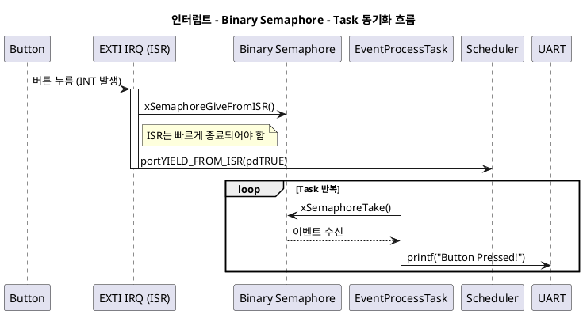

# 🧵 FreeRTOS - Binary Semaphore를 이용한 인터럽트 연동 예제

## 1. 목적 (Objective)

`외부 인터럽트(EXTI)` 발생한 이벤트를  
`FreeRTOS의 Binary Semaphore`를 사용하여 Task에서 안전하게 처리하는 구조 테스트

- ISR(인터럽트 서비스 루틴)은 빠르게 끝내고,  
- 실제 처리는 Task에서 하도록 분리하여 **실시간성과 안정성** 확보
---

## 2. 시스템 구성

| 구성 요소            | 설명                                                   |
|---------------------|--------------------------------------------------------|
| `EXTI15_10_IRQHandler` | USER 버튼 눌림 감지 시 Binary Semaphore를 Give        |
| `EventProcessTask`     | 세마포어를 Take하고 버튼 이벤트에 대응 (`printf`)     |
| `binSem`               | Binary Semaphore 핸들 (최대 1, 초기 0)                |

---

## 3. 동작 시나리오

- **사용자 버튼 누름** → `EXTI15_10_IRQHandler()` 인터럽트 발생  
- ISR은 `xSemaphoreGiveFromISR()`를 통해 시그널만 전달  
- Task는 `xSemaphoreTake()`로 이벤트를 감지하고 **비동기 처리**  
- UART 출력 등 느린 작업은 Task에서 실행하여 시스템 응답성 확보

---

## 4. 왜 인터럽트 안에서 오래 처리하면 안 될까?

🛑 위험한 상황들

| 문제 항목          | 설명 |
|-------------------|------|
| **다른 인터럽트 지연** | 현재 ISR이 실행 중이면 **우선순위가 낮은 다른 인터럽트가 BLOCK**됨 |
| **컨텍스트 전환 방해** | FreeRTOS 스케줄러가 Task로 빠르게 전환 못함 → **Task 응답성 저하** |
| **버그와 예외 위험** | ISR에서 `printf`, `malloc`, `HAL_Delay` 등 사용 시 **예측 불가 동작** 발생 |
| **우선순위 역전 악화** | 빠르게 끝내야 할 ISR이 오래 머물면 전체 시스템 응답 시간이 증가 |

✅ 따라서 **ISR에서는 오직 “시그널 전달만”**, 실 처리는 Task로 미루는 것이 **가장 안정적이고 확장 가능한 설계 패턴**입니다.
>여기서 세마포어는…
>ISR과 Task 사이에서 안전하게 이벤트를 전달하는 매개체입니다.
---

## 6. 주요 API 설명

- `xSemaphoreCreateBinary()` : Binary 세마포어 생성
- `xSemaphoreGiveFromISR()` : ISR 내에서 시그널 발생
- `xSemaphoreTake()` : Task 내에서 시그널 수신
- `portYIELD_FROM_ISR(pdTRUE)` : 우선순위 높은 Task로 빠른 전환 요청

---

## 7. 출력 예시 (UART 로그)
```
Button Pressed!
```
버튼을 누를 때마다 로그 출력


## 8. 시퀀스 다이어그램 



💡 확장 아이디어
- Counting Semaphore로 확장 → 여러 이벤트 누적 수신 가능
- vTaskDelay() 제거 → Task는 완전한 Blocking 대기로 빠른 응답
- GPIO 외에도 타이머, 센서 인터럽트 등 다양한 소스에 사용 가능

📎 관련 개념 요약
- `Binary Semaphore`	단일 신호 주고받기. ISR-Task 간 간단한 이벤트 전달
- `Counting Semaphore`	여러 이벤트 누적 처리. Buffer처럼 작동
- `Defer Interrupt Handling`	ISR에서 짧게 끝내고 Task에서 본 처리 담당
- `Context Switch`	현재 Task → 우선순위 높은 Task 전환 과정

🛠️ 실수 방지 체크리스트
 - ISR 내부에서 printf, HAL_Delay() 사용 ❌
 - ISR 종료 직후 portYIELD_FROM_ISR() 호출 ✅
 - 세마포어 생성 후 NULL 체크 ✅
 - EXTI_ClearFlag 또는 __HAL_GPIO_EXTI_CLEAR_IT() 호출 ✅