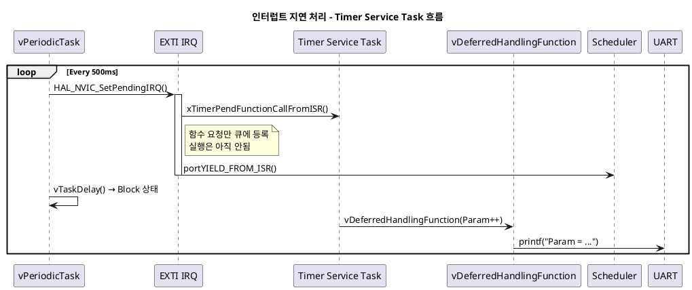

# FreeRTOS - 인터럽트 처리 지연 호출 (`xTimerPendFunctionCallFromISR`) 예제

## 1. 목적 (Objective)

인터럽트가 발생했을 때,  
그 처리를 `현재 Task가 끝난 뒤로 지연시켜` 실행하는 구조를 테스트

> 핵심: `xTimerPendFunctionCallFromISR()` 사용 → 인터럽트 안에서 실질 처리를 바로 하지 않고,  
> `Timer Service Task`가 나중에 처리하도록 요청함으로써 시스템의 안정성과 예측성을 향상

---

## 2. 시스템 구성

| 구성 요소              | 설명 |
|-----------------------|------|
| `EXTI15_10_IRQHandler` | 인터럽트 발생 시, 처리 함수 요청을 큐에 등록 (지연 실행) |
| `xTimerPendFunctionCallFromISR` | 처리 함수 `vDeferredHandlingFunction`을 Timer Queue에 등록 |
| `vPeriodicTask` | 500ms마다 인터럽트 강제 발생 (`HAL_NVIC_SetPendingIRQ`) |
| `vDeferredHandlingFunction` | 인터럽트에 의해 실제 처리되는 지연 함수 |
| Timer Service Task | 큐에 등록된 함수가 있는 경우 호출하여 실행 |

---

## 3. ⛓️ 동작 시나리오

1. `vPeriodicTask()`가 실행됨
2. 내부에서 `HAL_NVIC_SetPendingIRQ()` 호출 → `EXTI15_10_IRQHandler()` 실행됨
3. ISR에서 `xTimerPendFunctionCallFromISR()`를 통해 함수 실행을 요청  
   → 아직 실행되지 않고 Timer Queue에 등록됨
4. ISR 마지막에 `portYIELD_FROM_ISR()` 호출 → Context Switch 발생 요청
5. 현재 Task(`vPeriodicTask`)가 `vTaskDelay()`로 Block 상태 진입
6. 이제 우선순위가 높은 **Timer Service Task**가 실행됨
7. `vDeferredHandlingFunction()` 실행됨 → 실제 인터럽트 처리 수행

---

## 4. 주요 API 설명

| API | 설명 |
|-----|------|
| `xTimerPendFunctionCallFromISR(func, param1, param2, &flag)` | ISR에서 함수를 나중에 실행하도록 큐에 등록 |
| `portYIELD_FROM_ISR(flag)` | ISR 후에 우선순위 높은 Task가 있으면 Context Switch 유도 |
| `vDeferredHandlingFunction()` | 위임된 실제 처리 함수 (Timer Service Task가 실행) |

---

## 5. 출력 예시 (UART)
```
Periodic Task 실행 중...
인터럽트 처리 위임됨: Param = 0
Periodic Task 실행 중...
인터럽트 처리 위임됨: Param = 1
Periodic Task 실행 중...
인터럽트 처리 위임됨: Param = 2
```

## 6. 왜 이런 구조를 사용하는가?

| 항목 | 이유 |
|------|------|
| ISR은 빠르게 끝나야 함 | 인터럽트는 시스템 전체에 영향을 주기 때문에 최소화 필요 |
| ISR에서 `printf`, `연산`, `할당` 등은 위험 | 시간 오래 걸리며 다른 인터럽트와 Task 실행을 방해 |
| Timer Service Task 활용 | 시스템이 정한 우선순위와 정책에 따라 안정적으로 함수 실행 가능 |
| 우선순위 조정이 유연 | Timer Task보다 우선순위가 낮은 Task에서 호출하면, 자연스럽게 defer 처리 가능 |


## 7. 시퀀스 다이어그램


## 8. 관련 개념 요약
개념	설명
- Defer Interrupt Processing	ISR에서 함수를 바로 실행하지 않고, 나중에 Task에서 실행하게 함
- xTimerPendFunctionCallFromISR()	ISR에서 안전하게 처리 요청만 등록
- Timer Service Task	타이머 및 지연 처리 전담 Task
- Context Switch	높은 우선순위 Task로 전환 유도
- portYIELD_FROM_ISR()	ISR 후 스케줄러가 즉시 전환할 수 있도록 유도

## 9. 체크리스트
 - ISR은 처리 최소화 (No printf, No HAL_Delay)
 - 우선순위 조정 (Periodic Task < Timer Service Task)
 - xTimerPendFunctionCallFromISR() 호출 성공 여부 확인
 - portYIELD_FROM_ISR() 사용으로 즉시 Context Switch 요청