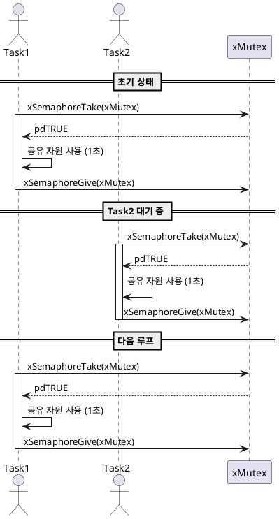

# 🔐 FreeRTOS Mutex 예제

## 1.목적 (Objective)

이 예제는 FreeRTOS에서 `뮤텍스(Mutex)`를 사용하여 두 개의 태스크(Task)가 공유 자원에 `동시에 접근하지 않도록 보호`하는 방법을 설명합니다.

---

## 2.시스템 구성 (System Configuration)

| 구성 요소        | 설명                                |
|-----------------|-------------------------------------|
| RTOS            | FreeRTOS                           |
| Task1           | Mutex를 얻고 1초간 자원 사용       |
| Task2           | Mutex를 얻고 1초간 자원 사용       |
| Synchronization | Mutex (`xSemaphoreCreateMutex`) 사용 |

---

## 3.동작 시나리오 (Execution Flow)

1. 시스템 시작 시 Mutex 생성
2. `Task1`, `Task2`는 각각 1초마다 Mutex를 요청
3. 먼저 Mutex를 얻은 Task만 공유 자원 사용 가능
4. 다른 Task는 Mutex가 반환될 때까지 대기
5. 공유 자원 사용 후 Mutex 반환
6. 두 Task는 번갈아 자원에 접근하며 교대로 실행


## 4.주요 함수 (Key Functions)

| 함수명              | 설명                                 |
|--------------------|--------------------------------------|
| `xSemaphoreCreateMutex()` | Mutex 객체 생성                    |
| `xSemaphoreTake()`       | Mutex 획득 시도                    |
| `xSemaphoreGive()`       | Mutex 반환                         |
| `vTaskDelay()`           | 지정된 시간만큼 Task 대기 상태로 전환 |
| `vTaskStartScheduler()`  | FreeRTOS 스케줄러 시작             |


## 5.UART 출력 예시 (Expected UART Output)
```
🔵 Task1: Mutex 얻음
🔵 Task1: Mutex 반환
🟢 Task2: Mutex 얻음
🟢 Task2: Mutex 반환
🔵 Task1: Mutex 얻음
```

## 6.시퀀스다이어그램
