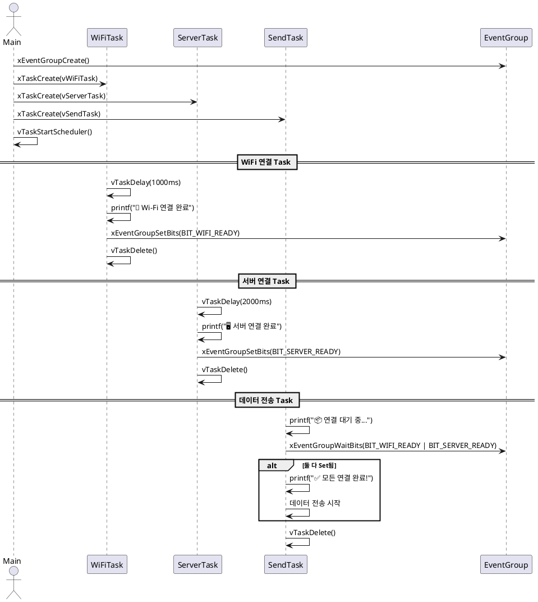

EVENTGROUP_NETWORKCONNECTIONSYNC.C 튜토리얼
이 문서는 EVENTGROUP_NETWORKCONNECTIONSYNC.C 예제 코드의 목표, 코드 설명, 예상 출력, 동작 시퀀스, 그리고 핵심 개념에 대해 설명합니다.

# 1. Objective (목표)
이 예제의 목적은 FreeRTOS의 Event Group을 사용하여 **여러 비동기 작업(Task)**의 완료 여부를 동기화하는 방법을 보여주는 것입니다.
특히, 네트워크 초기화 시나리오처럼 **여러 서브시스템(Task1, Task2 등)**이 준비될 때까지 메인 태스크가 기다렸다가 한 번에 진행하는 구조를 설명합니다.

# 2. Code Description (코드 설명)

```c
#define WIFI_CONNECTED_BIT   (1 << 0)   // vTask1 완료 비트
#define SERVER_CONNECTED_BIT   (1 << 1)   // vTask2 완료 비트
```
Event Group 내에서 각 작업 완료 여부를 나타내는 비트 마스크입니다.

```c
/*  Wi-Fi 연결 Task */
void vWifiConnectTask(void *pvParameters) {
    vTaskDelay(pdMS_TO_TICKS(1000));  // Wi-Fi 연결에 1초 소요되는 시뮬레이션
    printf("[Tick %lu]  Wi-Fi 연결 완료\n", xTaskGetTickCount());
    xEventGroupSetBits(xEventGroup, WIFI_CONNECTED_BIT);
    vTaskDelete(NULL);
}
```
vWifiConnectTask는 1000ms 후 완료되며, 완료 시 자신의 비트를 xEventGroupSetBits()를 통해 설정합니다.

```c
void vDataTask(void *pvParameters) {
    printf("[Tick %lu]  데이터 전송을 위해 연결 대기 중...\n", xTaskGetTickCount());

    xEventGroupWaitBits(
        xEventGroup,
        WIFI_CONNECTED_BIT | SERVER_CONNECTED_BIT,
        pdTRUE,     // 비트 자동 클리어
        pdTRUE,     // 모든 비트가 Set될 때까지 대기 (AND 조건)
        portMAX_DELAY
    );

    printf("[Tick %lu]  모든 연결 완료됨. 데이터 전송 시작!\n", xTaskGetTickCount());

    while (1) {
        printf("[Tick %lu]  주기적 데이터 전송 중...\n", xTaskGetTickCount());
        vTaskDelay(pdMS_TO_TICKS(2000));
    }
}
```
두 Task가 완료될 때까지 xEventGroupWaitBits()로 대기합니다.
pdTRUE로 설정된 clearOnExit 덕분에 비트는 자동 클리어됩니다.
pdTRUE로 설정된 waitForAllBits 덕분에 AND 조건으로 두 비트가 모두 설정되어야 다음으로 진행합니다.


# 3. Expected Output (예상 결과)
```bash
Main Task: 두 작업 완료 대기 중...
Task1 작업 완료
Task2 작업 완료
Main Task: 모든 작업 완료됨, 계속 진행!
작업 순서는 다음과 같이 진행됩니다:
Main Task가 대기 상태로 진입
Task1이 먼저 완료되며 비트를 설정
Task2가 이후 완료되며 비트를 설정

두 비트가 모두 설정되었으므로 Main Task가 깨어나고 작업을 이어감
```

# 4. 시퀀스 다이어그램 (Mermaid Diagram)

# 5. 핵심 개념 정리
개념	설명
Event Group	여러 비트를 하나의 그룹으로 관리하여 여러 Task의 상태를 동기화하는 데 유용
xEventGroupSetBits()	특정 비트를 설정 (작업 완료 표시 등)
xEventGroupWaitBits()	지정된 조건이 충족될 때까지 Task를 Blocked 상태로 유지
pdTRUE (AND 조건)	모든 비트가 설정되어야만 대기 해제
pdFALSE (OR 조건)	하나라도 설정되면 즉시 해제됨
자동 클리어 (pdTRUE)	조건 충족 후 해당 비트들을 자동으로 0으로 초기화

# 6. 활용 시나리오
네트워크 구성 준비 완료까지 대기

센서 초기화 Task 모두 완료될 때까지 메인 동작 보류

다중 외부 장치 연결이 완료될 때까지 동기화 처리

