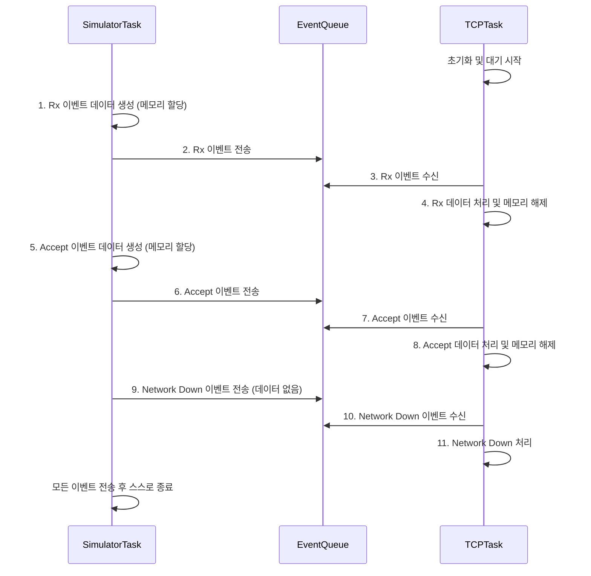

# `eventhandlingqueue.c` 튜토리얼

이 문서는 `eventhandlingqueue.c` 예제 코드의 목적, 동작 방식 및 예상 결과에 대해 설명합니다.

## 1. Objective (목표)

이 예제의 주요 목표는 FreeRTOS의 큐(Queue)를 활용한 여러 가지 이벤트를 한 곳에서 모아서 처리 패턴을 보여주고자함. (* FreeRtos 동적 메모리 할당/해제 주의하여 볼것 )

## 2.Code Description (코드 설명)

### `eIPEvent_t` – 이벤트 종류 정하기
- 시스템에서 발생할 수 있는 여러 가지 상황을 **이벤트 이름으로 구분**합니다.
  - `eNetworkDownEvent` → 네트워크 끊김
  - `eNetworkRxEvent` → 데이터 도착
  - `eTCPAcceptEvent` → 새로운 연결 요청

---

### `IPStackEvent_t` – 이벤트 한 개를 담는 구조
- 하나의 이벤트는 다음 두 정보를 가집니다:
  - `eEventType`: 어떤 종류의 이벤트인지 (`eIPEvent_t` 값)
  - `pvData`: 이벤트와 관련된 **추가 데이터(포인터)**  
    → 예: 도착한 데이터, 소켓 정보 등  
    → 데이터가 없으면 `NULL`

---

### `vSend...` 함수들 – 이벤트를 만드는 함수
- 각각의 함수는 특정 이벤트를 만들어서 큐에 넣습니다.
  - `vSendRxDataToTheTCPTask()` → 데이터 도착 이벤트 전송
  - `vSendAcceptRequestToTheTCPTask()` → 소켓 연결 요청 이벤트 전송
  - `vSendNetworkDownEventToTheTCPTask()` → 네트워크 끊김 알림

- 이벤트에 데이터가 필요하면,
  - 먼저 `pvPortMalloc()`으로 **동적 메모리 할당**
  - 포인터를 `pvData`에 넣어 큐에 함께 보냄

---

### `vTCPTask(void *pvParameters)` – 이벤트를 처리하는 Task
- 이 Task는 **이벤트를 하나씩 받아서 처리**하는 중앙 관리자입니다.
- 큐에서 이벤트를 꺼내고(`xQueueReceive()`),  
  `switch`문으로 이벤트 종류를 확인해 각각 다르게 처리합니다.
-  이벤트에 딸려온 데이터는 모두 사용 후 `vPortFree()`로 메모리 해제해야 함.

---

### `vEventSimulatorTask(void *pvParameters)` – 더미 이벤트
- 실제 네트워크 대신 **가짜 이벤트**를 순서대로 만들어서 큐에 보냅니다.
- 예:
  - "데이터 도착" → "연결 요청" → "네트워크 끊김"
- 테스트가 끝나면 자기 자신을 종료함 (`vTaskDelete(NULL)`)

---

#### `main(void)` – 시작점
- `xQueueCreate()`로 이벤트 큐(`xNetworkEventQueue`)를 만듭니다.
- `vTCPTask`, `vEventSimulatorTask` 두 개의 Task를 생성합니다.
  - `vTCPTask`의 우선순위가 더 높음 (이벤트 먼저 처리하게 함)
- `vTaskStartScheduler()`로 FreeRTOS 실행 시작!

## 3. Expected Output (예상 결과)

`vEventSimulatorTask`가 순차적으로 이벤트를 생성하여 큐에 넣으면, 우선순위가 더 높은 `vTCPTask`가 즉시 해당 이벤트를 수신하여 처리합니다. 모든 이벤트 처리가 완료된 후 `vEventSimulatorTask`는 종료됩니다.

### 3.1. 시리얼 출력 (Serial Output)

```
[TCP Task] Task started
[TCP Task] Queue waiting: 0

[SIM] 시뮬레이션 이벤트...

[TCP Task] Queue waiting: 1
[TCP Task] Event received: 1
Received data: Hello from network!

[TCP Task] Queue waiting: 1
[TCP Task] Event received: 2
Accepted socket id: 42

[TCP Task] Queue waiting: 1
[TCP Task] Event received: 0
Network down event received.

[SIM] All events sent, task terminating

[TCP Task] Queue waiting: 0
[TCP Task] Queue waiting: 0
[TCP Task] Queue waiting: 0
```

## 4. 동작 원리 (Mermaid Diagram)



## 5. 핵심 개념: 이벤트 기반 프로그래밍 (Event-Driven Programming)

- **중앙 집중 처리**: 여러 소스(인터럽트, 다른 태스크 등)에서 발생하는 비동기적인 이벤트들을 하나의 큐로 모아, 단일 태스크에서 순서대로 처리함으로써 시스템의 동작을 단순화하고 예측 가능하게 만듭니다.
- **디커플링(Decoupling)**: 이벤트를 생성하는 측(Producer)과 처리하는 측(Consumer)이 큐를 통해 분리됩니다. 생산자는 이벤트 처리 방식에 대해 알 필요가 없고, 소비자도 이벤트 발생 시점에 대해 알 필요가 없습니다. 이는 코드의 모듈성과 재사용성을 높여줍니다.
- **데이터 전달**: `void*` 포인터를 사용하여 어떤 종류의 데이터든 유연하게 전달할 수 있습니다. 단, 데이터를 수신한 측에서 정확한 타입으로 캐스팅하고, 동적으로 할당된 메모리를 해제하는 책임을 져야 합니다.
