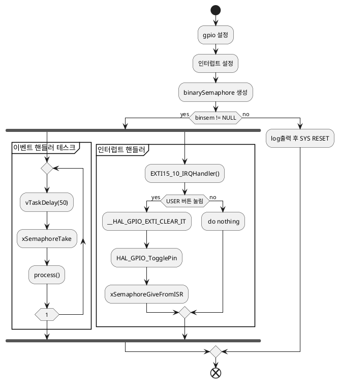

```plantuml

@startuml
start

:gpio 설정;
:인터럽트 설정;
:binarySemaphore 생성;

if (binsem != NULL) then (yes)
    fork
        group 이벤트 핸들러 테스크
            repeat
                :vTaskDelay(50);
                :xSemaphoreTake;
                :process();
            repeat while (1)
        end group
    fork again
        group 인터럽트 핸들러
            :EXTI15_10_IRQHandler();
            if (USER 버튼 눌림) then (yes)
                :__HAL_GPIO_EXTI_CLEAR_IT;
                :HAL_GPIO_TogglePin;
                :xSemaphoreGiveFromISR;
            else (no)
                : do nothing;
            endif
        end group
    end fork
else (no)
    :log출력 후 SYS RESET;
endif

end
@enduml


```