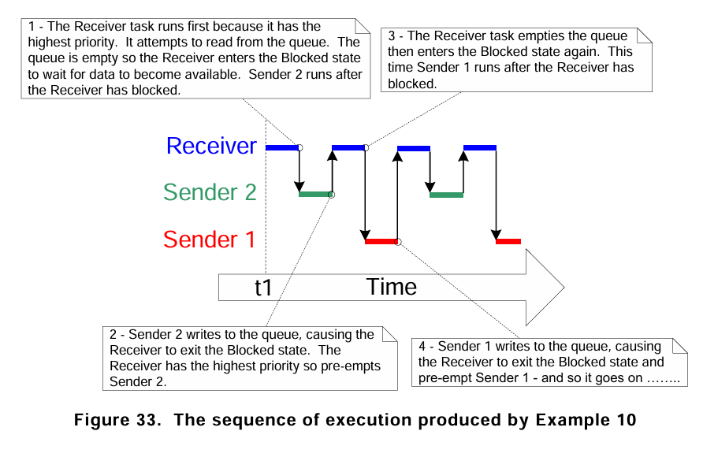

# `blockingqueue.c` 튜토리얼

이 문서는 `blockingqueue.c` 예제 코드의 목적, 동작 방식 및 예상 결과에 대해 설명합니다.

## 1. Objective (목표)

이 예제의 주요 목표는 FreeRTOS의 **큐(Queue)**를 사용하여 여러 태스크 간에 안전하게 데이터를 주고받는 방법을 시연하는 것입니다. 특히, 큐가 가득 찼을 때 송신 태스크가 **블로킹(Blocking)**되고, 큐가 비어있을 때 수신 태스크가 블로킹되는 동작을 확인합니다.

이 예제에서는 두 개의 송신 태스크가 각각 다른 값을 큐에 보내고, 하나의 수신 태스크가 이 값들을 받아서 처리하는 과정을 보여줍니다.

## 2. Code Description (코드 설명)

- **`sendData(void *pvParameters)` (송신 태스크)**
  - 이 함수는 두 개의 태스크, `Sender1`과 `Sender2`에 의해 실행됩니다.
  - `pvParameters`로 전달된 값(각각 `100`과 `200`)을 `valueToSend`에 저장합니다.
  - `xQueueSendToBack()` 함수를 사용하여 큐의 뒤쪽에 데이터를 보냅니다.
    - 만약 큐가 가득 차 있으면, 이 태스크는 다른 태스크가 큐에서 데이터를 가져갈 때까지 **대기(Block)** 상태가 됩니다.
  - 데이터 전송 후, `vTaskDelay()`를 통해 200ms 동안 대기합니다.

- **`receiveData(void *pvParameters)` (수신 태스크)**
  - `xQueueReceive()` 함수를 사용하여 큐에서 데이터를 가져옵니다.
    - 만약 큐가 비어있으면, 이 태스크는 새로운 데이터가 큐에 들어올 때까지 **무한정 대기(Block)** 상태가 됩니다 (`portMAX_DELAY`).
  - 데이터를 성공적으로 수신하면, 시리얼 포트로 `Receive d = [값]` 형식의 메시지를 출력합니다.

- **`main(void)`**
  - `Driver_Init()`를 호출하여 MCU의 하드웨어를 초기화합니다.
  - `xQueueCreate()`를 사용하여 크기가 5이고, `int32_t` 타입의 데이터를 저장할 수 있는 큐를 생성합니다.
  - `xTaskCreate` 함수를 사용하여 `Sender1`, `Sender2`, `Receiver` 태스크를 생성합니다.
    - `Sender1` 우선순위: 1
    - `Sender2` 우선순위: 2
    - `Receiver` 우선순위: 3 (가장 높음)
  - `vTaskStartScheduler()`를 호출하여 FreeRTOS 스케줄러를 시작합니다.

## 3. Expected Output (예상 결과)

코드가 실행되면 스케줄러는 우선순위가 가장 높은 `Receiver` 태스크를 먼저 실행하려고 하지만, 큐가 비어있어 `Receiver`는 즉시 블로킹 상태가 됩니다. 그 후, `Sender2`(우선순위 2)와 `Sender1`(우선순위 1)이 차례로 데이터를 큐에 넣습니다. 데이터가 큐에 추가되면, `Receiver` 태스크가 다시 활성화되어 데이터를 처리합니다.

### 3.1. 시리얼 출력 (Serial Output)

시리얼 터미널에서는 `Receiver` 태스크가 큐에서 수신한 값들이 출력됩니다. `Sender1`과 `Sender2`가 200ms마다 데이터를 보내므로, `Receiver`는 주기적으로 두 값을 번갈아 수신하여 출력합니다.

```
Receive d = 200
Receive d = 100
Receive d = 200
Receive d = 100
Receive d = 200
Receive d = 100
...
```

## 4. Queue 동작 방식



이 예제에서 큐는 다음과 같이 동작합니다.

1. **초기 상태**: `Receiver` 태스크는 우선순위가 가장 높지만, 큐가 비어있기 때문에 `xQueueReceive()`에서 대기(Blocked) 상태가 됩니다.
2. **데이터 전송**: `Sender2`(우선순위 2)가 실행되어 값 `200`을 큐에 넣습니다. 그 후 테스크의 레디 상태의 우선 순위가 가장 높은 Receive Task가 수행됩니다.
3. **데이터 수신**: 큐에 데이터가 들어오면, 대기 중이던 `Receiver` 태스크가 즉시 활성화(Ready)됩니다. `Receiver`는 우선순위가 가장 높으므로, 다른 태스크들을 선점하고 CPU 제어권을 가져와 큐의 첫 번째 데이터(`200`)를 읽고 출력합니다.
4. **반복**: `Receiver`가 다시 `xQueueReceive()`를 호출하며 대기 상태로 돌아가면, `Sender` 태스크들이 다시 실행되어 큐에 데이터를 넣습니다. 이 과정이 계속 반복됩니다.

이처럼 큐는 태스크 간의 **동기화**를 맞추는 중요한 역할을 합니다. 데이터가 있을 때만 수신 태스크가 동작하고, 큐에 공간이 있을 때만 송신 태스크가 데이터를 보낼 수 있도록 하여 시스템 자원을 효율적으로 사용하게 합니다.