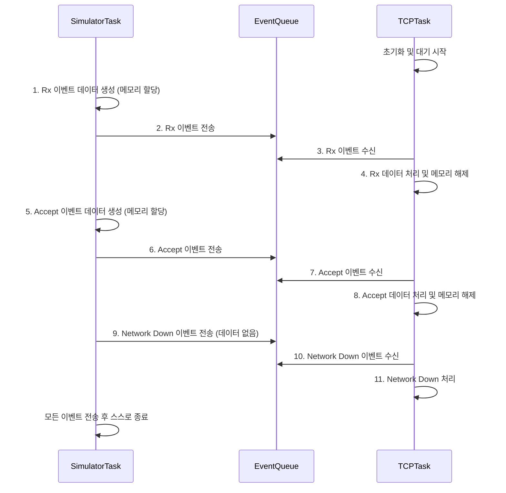

# `eventhandlingqueue.c` 튜토리얼

이 문서는 `eventhandlingqueue.c` 예제 코드의 목적, 동작 방식 및 예상 결과에 대해 설명합니다.

## 1. Objective (목표)

이 예제의 주요 목표는 FreeRTOS의 **큐(Queue)**를 사용하여 **다양한 종류의 이벤트(Event)**를 중앙 집중식으로 처리하는 방법을 시연하는 것입니다. TCP/IP 스택과 같이 여러 비동기 이벤트가 발생하는 시스템에서, 모든 이벤트를 단일 큐에 넣고 전용 태스크가 이를 순차적으로 처리하는 일반적인 설계 패턴을 학습합니다.

## 2. Code Description (코드 설명)

- **`eIPEvent_t` (이벤트 타입 열거형)**
  - `eNetworkDownEvent`, `eNetworkRxEvent`, `eTCPAcceptEvent` 등 발생할 수 있는 이벤트의 종류를 정의합니다.

- **`IPStackEvent_t` (이벤트 구조체)**
  - `eEventType`: 어떤 종류의 이벤트인지를 나타내는 `eIPEvent_t` 타입의 멤버입니다.
  - `pvData`: 이벤트와 관련된 데이터를 담는 `void` 포인터입니다. 데이터가 없는 이벤트(예: `eNetworkDownEvent`)의 경우 `NULL`이 됩니다.

- **`vSend...` 함수들 (이벤트 생성 및 전송 함수)**
  - `vSendRxDataToTheTCPTask`, `vSendAcceptRequestToTheTCPTask`, `vSendNetworkDownEventToTheTCPTask` 함수들은 각각 다른 종류의 이벤트를 생성하여 `xNetworkEventQueue` 큐로 전송합니다.
  - 데이터가 있는 이벤트의 경우, `pvPortMalloc`으로 메모리를 할당하고 `pvData`에 포인터를 담아 전송합니다.

- **`vTCPTask(void *pvParameters)` (이벤트 처리 태스크)**
  - 이 태스크는 시스템의 메인 이벤트 루프 역할을 합니다.
  - `xQueueReceive()`를 호출하여 `xNetworkEventQueue`로부터 이벤트를 수신 대기합니다.
  - 이벤트를 수신하면, `switch` 문을 사용하여 `eEventType`에 따라 적절한 처리를 수행합니다.
  - `pvData`로 전달된 포인터가 있다면, 해당 데이터를 처리한 후 **`vPortFree()`를 호출하여 메모리를 반드시 해제**합니다.

- **`vEventSimulatorTask(void *pvParameters)` (이벤트 시뮬레이터 태스크)**
  - 실제 네트워크 동작을 흉내 내어, 다양한 종류의 이벤트를 순차적으로 생성하고 큐로 전송하는 역할을 합니다.
  - 모든 이벤트를 보낸 후 `vTaskDelete(NULL)`을 호출하여 스스로 종료됩니다.

- **`main(void)`**
  - `xQueueCreate()`를 사용하여 `IPStackEvent_t` 구조체를 담을 수 있는 큐를 생성합니다.
  - `vTCPTask`와 `vEventSimulatorTask`를 생성합니다. 이때, 이벤트 처리를 우선하기 위해 `vTCPTask`의 우선순위를 더 높게 설정합니다.
  - `vTaskStartScheduler()`를 호출하여 스케줄러를 시작합니다.

## 3. Expected Output (예상 결과)

`vEventSimulatorTask`가 순차적으로 이벤트를 생성하여 큐에 넣으면, 우선순위가 더 높은 `vTCPTask`가 즉시 해당 이벤트를 수신하여 처리합니다. 모든 이벤트 처리가 완료된 후 `vEventSimulatorTask`는 종료됩니다.

### 3.1. 시리얼 출력 (Serial Output)

```
[INFO] Event Handling Queue Demo Started
[INFO] Starting FreeRTOS Scheduler...
[TCP Task] Task started
[TCP Task] Queue waiting: 0
[SIM] Sending simulated events...
[SEND] Rx Event Sent
[TCP Task] Queue waiting: 1
[TCP Task] Event received: 1
Received data: Hello from network!
[SEND] Accept Event Sent
[TCP Task] Queue waiting: 1
[TCP Task] Event received: 2
Accepted socket id: 42
[SEND] NetworkDown Event Sent
[TCP Task] Queue waiting: 1
[TCP Task] Event received: 0
Network down event received.
[SIM] All events sent, task terminating
```

## 4. 동작 원리 (Mermaid Diagram)



## 5. 핵심 개념: 이벤트 기반 프로그래밍 (Event-Driven Programming)

- **중앙 집중 처리**: 여러 소스(인터럽트, 다른 태스크 등)에서 발생하는 비동기적인 이벤트들을 하나의 큐로 모아, 단일 태스크에서 순서대로 처리함으로써 시스템의 동작을 단순화하고 예측 가능하게 만듭니다.
- **디커플링(Decoupling)**: 이벤트를 생성하는 측(Producer)과 처리하는 측(Consumer)이 큐를 통해 분리됩니다. 생산자는 이벤트 처리 방식에 대해 알 필요가 없고, 소비자도 이벤트 발생 시점에 대해 알 필요가 없습니다. 이는 코드의 모듈성과 재사용성을 높여줍니다.
- **데이터 전달**: `void*` 포인터를 사용하여 어떤 종류의 데이터든 유연하게 전달할 수 있습니다. 단, 데이터를 수신한 측에서 정확한 타입으로 캐스팅하고, 동적으로 할당된 메모리를 해제하는 책임을 져야 합니다.
