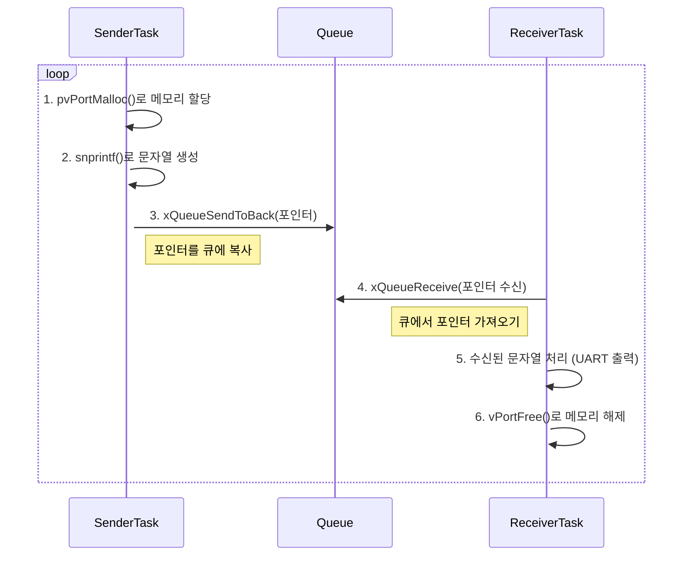

# `queuingpointers.c` 튜토리얼

이 문서는 `queuingpointers.c` 예제 코드의 목적, 동작 방식 및 예상 결과에 대해 설명합니다.

## 1. Objective (목표)

이 예제의 주요 목표는 FreeRTOS의 **큐(Queue)**를 사용하여 태스크 간에 **포인터**를 안전하게 전달하는 방법을 시연하는 것입니다. 특히, 동적으로 할당된 메모리의 주소(포인터)를 큐로 보내고, 수신 측에서 해당 메모리를 사용하는 방법을 보여줍니다. 이를 통해 큰 데이터를 복사하지 않고 
효율적으로 전달할 수 있습니다.

## 2. 기존 큐와 차이

```mermaid
flowchart TD
  %% 🚀 개선 방식
  subgraph After["📦 큐잉포인터: 포인터만 큐 전송"]
    A10["Start"]
    A1["Task1: 버퍼 확보 (prvGetBuffer)"]
    B1["버퍼에 문자열 작성 (snprintf)"]
    C1["포인터만 큐에 전송 (xQueueSend)"]
    D1["큐 저장: 버퍼 주소만 저장"]
    E1["Task2: 포인터 수신 (xQueueReceive)"]
    F1["Task2: 문자열 사용 (vPrintString)"]
    G1["버퍼 반환 (prvReleaseBuffer)"]
    G12["End"]
  end

  %% 📦 기존 방식
  subgraph Before["📦 기존 방식: 데이터 자체 큐 전송"]
    A0["Start"]
    A["Task1: 데이터 생성 (문자열)"]
    B["큐에 문자열 데이터 자체 복사"]
    C["큐 저장: 문자열 내용 포함"]
    D["Task2: 큐에서 문자열 복사 받음"]
    E["Task2: 문자열 사용 (예: 출력)"]
    G2["End"]
  end

  %% After 연결선
  A10 --> A1
  A1 --> B1
  B1 --> C1
  C1 --> D1
  D1 --> E1
  E1 --> F1
  F1 --> G1
  G1 --> G12

  %% Before 연결선
  A0 --> A
  A --> B
  B --> C
  C --> D
  D --> E
  E --> G2

  %% 🎨 스타일 꾸미기
  %% 시작과 끝 원형 처리
  style A10 fill:#00C853,stroke:#004D40,stroke-width:2px
  style G12 fill:#0091EA,stroke:#01579B,stroke-width:2px
  style A0 fill:#00C853,stroke:#004D40,stroke-width:2px
  style G2 fill:#0091EA,stroke:#01579B,stroke-width:2px

  %% After 스타일
  style A1 fill:#FFF59D,stroke:#FBC02D
  style B1 fill:#FFE082,stroke:#F57F17
  style C1 fill:#FFAB91,stroke:#D84315
  style D1 fill:#B2EBF2,stroke:#0097A7
  style E1 fill:#B2DFDB,stroke:#00796B
  style F1 fill:#DCEDC8,stroke:#558B2F
  style G1 fill:#D1C4E9,stroke:#6A1B9A

  %% Before 스타일
  style A fill:#FFF59D,stroke:#FBC02D
  style B fill:#FFE082,stroke:#F57F17
  style C fill:#B2EBF2,stroke:#0097A7
  style D fill:#B2DFDB,stroke:#00796B
  style E fill:#DCEDC8,stroke:#558B2F

```



## 3. Code Description (코드 설명)

- **`SenderTask(void *pvParameters)` (송신 태스크)**
  - `pvPortMalloc()`을 사용하여 50바이트 크기의 메모리 블록을 동적으로 할당합니다.
  - `snprintf()`를 사용하여 할당된 메모리에 "Hello from SenderTask [번호]" 형식의 문자열을 저장합니다.
  - `xQueueSendToBack()` 함수를 사용하여 생성된 문자열의 **포인터**를 큐로 전송합니다.
  - 100ms 마다 이 과정을 반복합니다.

- **`ReceiverTask(void *pvParameters)` (수신 태스크)**
  - `xQueueReceive()` 함수를 사용하여 큐로부터 포인터를 수신합니다.
  - 수신된 포인터가 가리키는 메모리의 문자열을 시리얼 포트로 출력합니다.
  - **`vPortFree()`**를 호출하여 수신된 포인터가 가리키는 메모리를 **해제**합니다. 이는 메모리 누수(Memory Leak)를 방지하는 매우 중요한 과정입니다.

- **`main(void)`**
  - `Driver_Init()`를 호출하여 MCU의 하드웨어를 초기화합니다.
  - `xQueueCreate()`를 사용하여 크기가 5이고, `char*` (문자열 포인터) 타입의 데이터를 저장할 수 있는 큐를 생성합니다.
  - `xTaskCreate` 함수를 사용하여 `SenderTask`와 `ReceiverTask`를 생성합니다.
    - `SenderTask` 우선순위: 1
    - `ReceiverTask` 우선순위: 2 (더 높음)
  - `vTaskStartScheduler()`를 호출하여 FreeRTOS 스케줄러를 시작합니다.

## 4. Expected Output (예상 결과)

`SenderTask`가 동적으로 문자열을 생성하여 포인터를 큐에 넣으면, 우선순위가 더 높은 `ReceiverTask`가 즉시 해당 포인터를 수신하여 문자열을 출력하고 메모리를 해제합니다. 이 과정이 계속 반복됩니다.

### 5.1. 시리얼 출력 (Serial Output)

시리얼 터미널에서는 `SenderTask`와 `ReceiverTask`가 번갈아 출력하는 메시지를 볼 수 있습니다.

```
Hello from SenderTask 0
Hello from SenderTask 0
Hello from SenderTask 1
Hello from SenderTask 1
Hello from SenderTask 2
Hello from SenderTask 2
...
```

## 6. 동작 원리 (Mermaid Diagram)



## 7. 핵심 개념: 포인터 전달의 장점과 주의점

- **장점**: 큰 데이터(예: 긴 문자열, 구조체)를 큐로 전달할 때, 데이터 전체를 복사하는 대신 4바이트(32비트 시스템 기준) 포인터만 전달하므로 매우 빠르고 효율적입니다. 큐 자체의 메모리 사용량도 줄일 수 있습니다.

- **주의점**: 
  - **메모리 소유권(Ownership)**: 포인터를 전달할 때는 누가 메모리를 할당하고 해제할 책임이 있는지 명확히 해야 합니다. 이 예제에서는 `SenderTask`가 할당하고 `ReceiverTask`가 해제합니다.
  - **메모리 누수(Memory Leak)**: `ReceiverTask`에서 `vPortFree()`를 호출하지 않으면, `SenderTask`가 계속해서 할당하는 메모리가 해제되지 않아 결국 시스템의 힙(Heap) 메모리가 고갈됩니다.
  - **댕글링 포인터(Dangling Pointer)**: 메모리가 해제된 후에도 해당 포인터를 사용하려고 하면 예기치 않은 동작이나 시스템 충돌이 발생할 수 있습니다.
