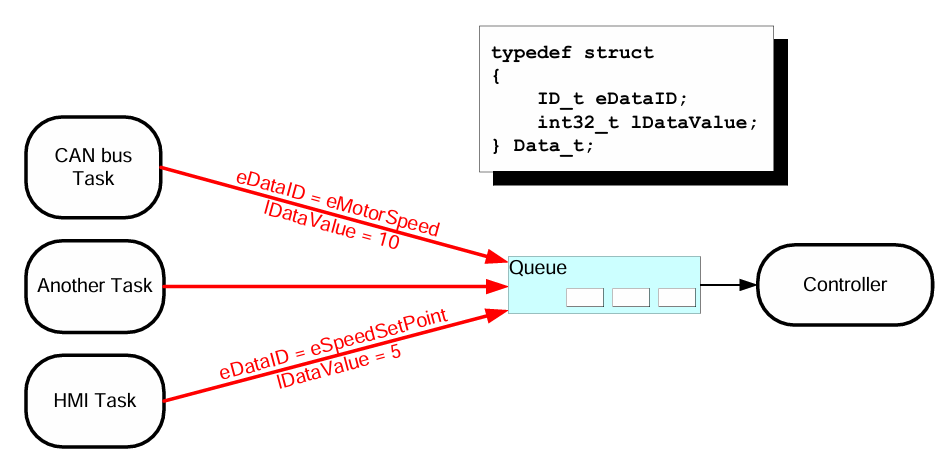
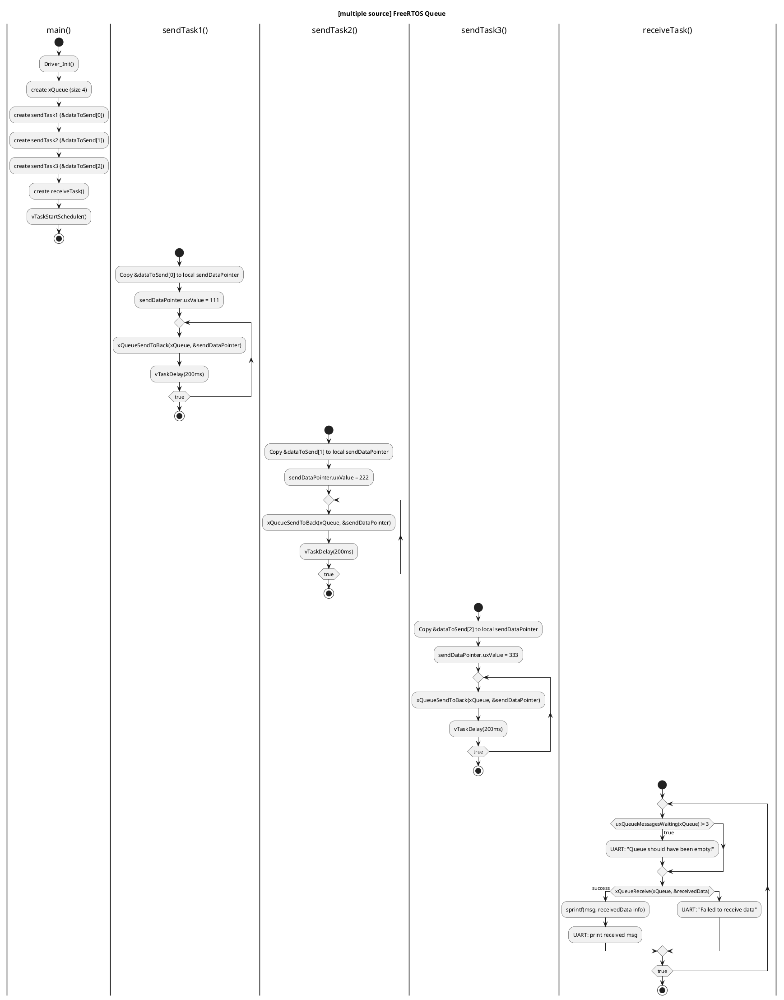
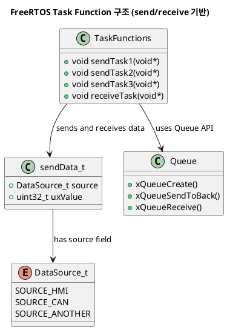

# `receivingdata_multiplesource.c` 튜토리얼

이 문서는 `receivingdata_multiplesource.c` 예제 코드의 목적, 동작 방식 및 예상 결과에 대해 설명합니다.

## 1. Objective (목표)

이 예제의 주요 목표는 FreeRTOS의 **큐(Queue)**를 사용하여 여러 소스(Task)로부터 들어오는 데이터를 하나의 태스크에서 수신하고 처리하는 방법을 시연하는 것입니다. 각 데이터 소스를 식별하기 위해 데이터 구조체에 `source` 필드를 포함하여 사용합니다.

이 예제에서는 세 개의 송신 태스크가 각각 다른 소스로부터의 데이터를 큐에 보내고, 하나의 수신 태스크가 이 값들을 받아서 소스에 따라 구분하여 처리하는 과정을 보여줍니다.


## 2. Code Description (코드 설명)



*Figure 1: FreeRTOS Queue를 사용한 다중 소스 데이터 수신 구조도*


## 3. 다이어그램



## class Diagram



- **`DataSource_t` (데이터 소스 열거형)**
  - `SOURCE_HMI`, `SOURCE_CAN`, `SOURCE_ANOTHER`와 같이 데이터가 어디로부터 왔는지를 나타내는 열거형입니다.

- **`sendData_t` (데이터 구조체)**
  - `source`: `DataSource_t` 타입으로 데이터의 출처를 나타냅니다.
  - `uxValue`: 실제 전송될 데이터 값입니다.

- **`sendTask1`, `sendTask2`, `sendTask3` (송신 태스크)**
  - 각각 `SOURCE_HMI`, `SOURCE_CAN`, `SOURCE_ANOTHER` 소스를 대표하는 태스크입니다.
  - 각 태스크는 고유한 값을 `sendData_t` 구조체에 담아 `xQueueSendToBack()` 함수를 사용하여 큐로 전송합니다.
  - 데이터 전송 후, `vTaskDelay()`를 통해 200ms 동안 대기합니다.

- **`receiveTask(void *pvParameters)` (수신 태스크)**
  - `xQueueReceive()` 함수를 사용하여 큐에서 데이터를 가져옵니다.
  - 데이터를 성공적으로 수신하면, `sendData_t` 구조체의 `source` 필드를 확인하여 어떤 소스로부터 데이터가 왔는지 식별합니다.
  - 시리얼 포트로 수신된 데이터의 소스와 값을 출력합니다.

- **`main(void)`**
  - `Driver_Init()`를 호출하여 MCU의 하드웨어를 초기화합니다.
  - `xQueueCreate()`를 사용하여 크기가 4이고, `sendData_t` 타입의 데이터를 저장할 수 있는 큐를 생성합니다.
  - `xTaskCreate` 함수를 사용하여 3개의 송신 태스크와 1개의 수신 태스크를 생성합니다.
    - 송신 태스크 우선순위: 1
    - 수신 태스크 우선순위: 4 (가장 높음)
  - `vTaskStartScheduler()`를 호출하여 FreeRTOS 스케줄러를 시작합니다.

## 3. Expected Output (예상 결과)

코드가 실행되면, 3개의 송신 태스크가 각각의 데이터를 큐에 보냅니다. 우선순위가 가장 높은 `receiveTask`는 큐에 데이터가 들어올 때마다 즉시 데이터를 수신하여 처리합니다.

### 3.1. 시리얼 출력 (Serial Output)

시리얼 터미널에서는 `receiveTask`가 큐에서 수신한 데이터의 소스와 값이 번갈아 출력됩니다.


*Figure 2: 예상되는 시리얼 터미널 출력*

```
Received from source 0: value = 111
Received from source 1: value = 222
Received from source 2: value = 333
Received from source 0: value = 111
Received from source 1: value = 222
Received from source 2: value = 333
...
```

* `source 0`은 `SOURCE_HMI`, `source 1`은 `SOURCE_CAN`, `source 2`는 `SOURCE_ANOTHER`를 의미합니다.

## 4. 핵심 개념

이 예제는 여러 소스로부터의 데이터를 단일 큐로 관리하는 일반적인 패턴을 보여줍니다. 데이터 구조체에 **식별자(ID 또는 소스)**를 포함시킴으로써, 수신 측에서는 이 식별자를 통해 데이터를 구분하고 각각에 맞는 처리를 할 수 있습니다. 이는 다양한 센서나 통신 채널로부터의 데이터를 중앙에서 관리하는 시스템을 구현할 때 매우 유용한 방법입니다.
