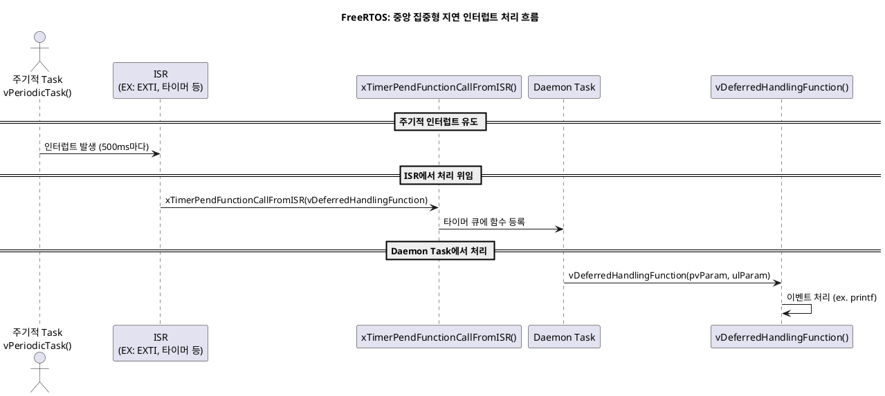

```plantuml
@startuml
title FreeRTOS: 중앙 집중형 지연 인터럽트 처리 흐름

actor "주기적 Task\nvPeriodicTask()" as Periodic
participant "ISR\n(EX: EXTI, 타이머 등)" as ISR
participant "xTimerPendFunctionCallFromISR()" as PendCall
participant "Daemon Task" as Daemon
participant "vDeferredHandlingFunction()" as Handler

== 주기적 인터럽트 유도 ==
Periodic -> ISR: 인터럽트 발생 (500ms마다)

== ISR에서 처리 위임 ==
ISR -> PendCall: xTimerPendFunctionCallFromISR(vDeferredHandlingFunction)
PendCall -> Daemon: 타이머 큐에 함수 등록

== Daemon Task에서 처리 ==
Daemon -> Handler: vDeferredHandlingFunction(pvParam, ulParam)
Handler -> Handler: 이벤트 처리 (ex. printf)

@enduml

```

